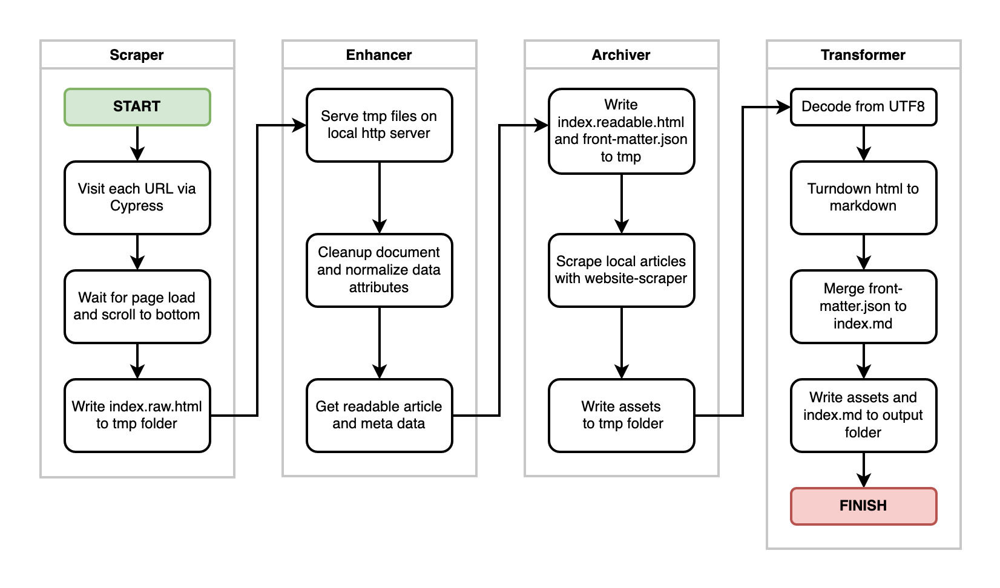

# Article Archiver 

The purpose of this library is to convert online articles / blog posts into local markdown by preserving:

- article content
- media assets
- meta data

The heavy lifting around scraping is done with [Cypress](https://www.cypress.io/) and the content is enhanced with [Mozilla Readability](https://github.com/mozilla/readability).

# Installation

```bash
npm install -g article-archiver
```

# Usage

```bash
article-archiver <urls>
```

# Architecture



# TODO

- [x] setup cypress
- [x] configure cypress to scrape URL's
- [ ] implement code cleaner and enhancer
- [ ] implement readability
- [ ] wire up scraper to enhancer
- [ ] setup http server for tmp files
- [ ] setup website-scraper
- [ ] wire up archiver to save local assets to tmp folder
- [ ] setup utf8 and turndown transformers
- [ ] wire up transformer to merge meta data and write to output
